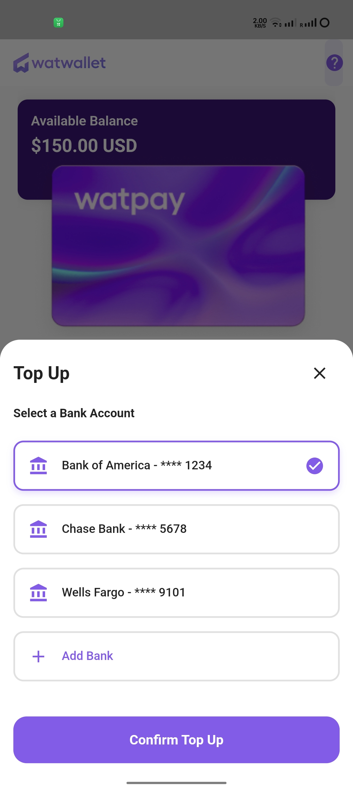

# App Usage Flow

Figma Link: [https://www.figma.com/design/tcWTj5AJud7ZbIUzuj6D9d/Test?node-id=0-1&t=ZIaXWmQxrh1q9vTd-1](https://www.figma.com/design/tcWTj5AJud7ZbIUzuj6D9d/Test?node-id=0-1&t=ZIaXWmQxrh1q9vTd-1)

For the APK, please find it in:

```
release > app-release.apk
```

This README provides an overview of the app's usage flow with corresponding screenshots.

## App Flow

### 1. App Icon, Loading, and Onboarding

| App Icon | Loading Screen | Onboarding |
| --- | --- | --- |
|  |  |  |

### 2. Dashboard Screens

| Dashboard Loaded | Top-up Screen | Top-up Selected |
| --- | --- | --- |
|  |  |  |

### 3. Transaction History and Card Management

| Transaction History | Manage Card | Card Details |
| --- | --- | --- |
|  |  |  |

### 4. Card Upgrade, Freeze, and Terminate

| Card Upgrade | Freeze Card | Terminate Card |
| --- | --- | --- |
|  |  |  |

### 5. Additional Options

| Terminate Card Option | Terms and Conditions | Upgrade Card |
| --- | --- | --- |
|  |  |  |